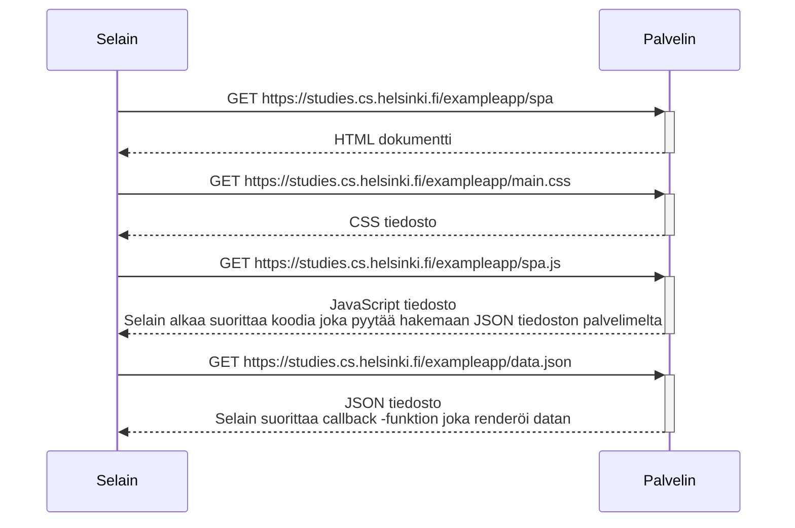

```mermaid
  sequenceDiagram
    participant S as Selain
    participant P as Palvelin

    S->>+P: GET https://studies.cs.helsinki.fi/exampleapp/spa
    P-->>-S: HTML dokumentti
    S->>+P: GET https://studies.cs.helsinki.fi/exampleapp/main.css
    P-->>-S: CSS tiedosto
    S->>+P: GET https://studies.cs.helsinki.fi/exampleapp/spa.js
    P-->>-S: JavaScript tiedosto<br/>Selain alkaa suorittaa koodia joka pyytää hakemaan JSON tiedoston palvelimelta
    S->>+P: GET https://studies.cs.helsinki.fi/exampleapp/data.json
    P-->>-S: JSON tiedosto<br/>Selain suorittaa callback -funktion joka renderöi datan
```
