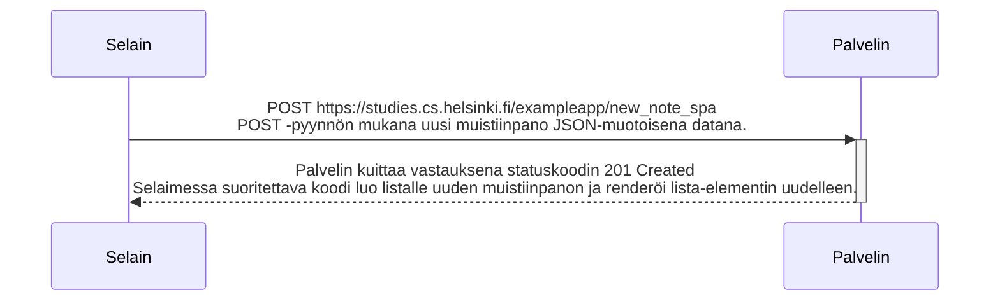

```mermaid
  sequenceDiagram
    participant S as Selain
    participant P as Palvelin

    S->>+P: POST https://studies.cs.helsinki.fi/exampleapp/new_note_spa<br/>POST -pyynnön mukana uusi muistiinpano JSON-muotoisena datana.
    P-->>-S: Palvelin kuittaa vastauksena statuskoodin 201 Created<br/>Selaimessa suoritettava koodi luo listalle uuden muistiinpanon ja renderöi lista-elementin uudelleen.
    
```
